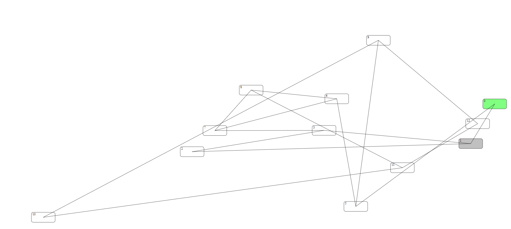
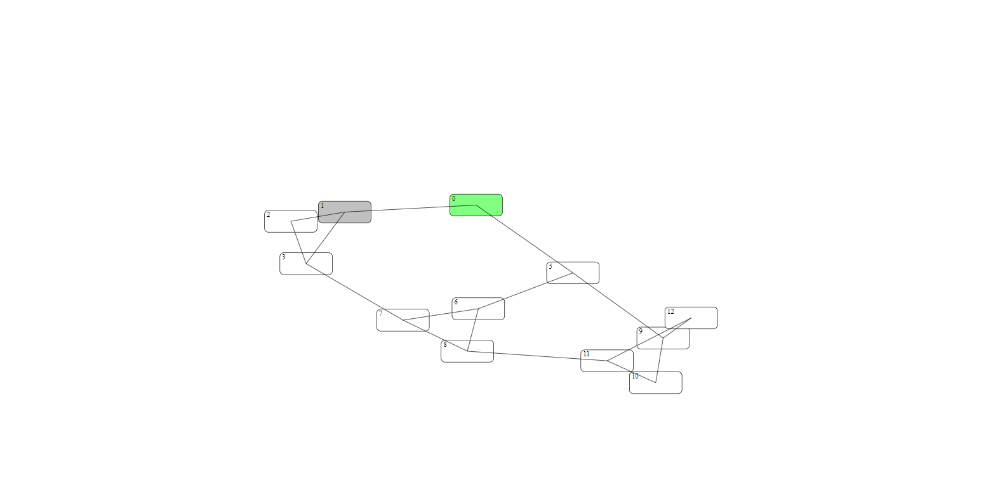
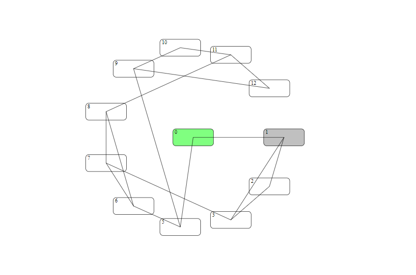
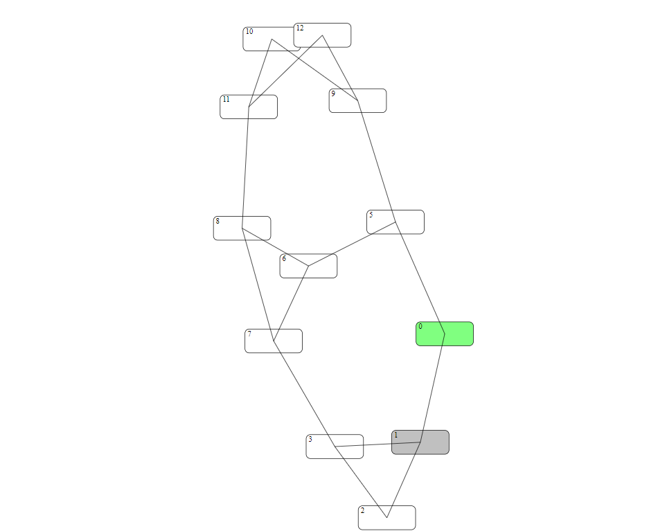

# PhpGraphToSvg - Force Directed Graph

[](https://packagist.org/packages/cmcdota/php-graph-to-svg)
[](https://packagist.org/packages/cmcdota/php-graph-to-svg)


Simple realisation of Force-Directed [Fruchterman–Reingold algorithm](https://reingold.co/force-directed.pdf).

Special Thanks to [Philipp Kindermann](https://seafile.rlp.net/f/1f06c2943e114d429b48/).

## Installation

Install the latest version with

```bash
$ composer require cmcdota/php-graph-to-svg
```

## Basic Usage
```php
use Cmcdota\PhpGraphToSvg\Board;

//Describe Vertexes and their edges (links)
$vertexes = [
    0 => ['name' => '0', 'fill'=> '80ff80', 'edges' => [1]],
    1 => ['name' => '1','fill'=> 'c0c0c0', 'edges' => [2]],
    2 => ['name' => '2', 'edges' => [3]],
    3 => ['name' => '3', 'edges' => [1]],
    5 => ['name' => '5', 'edges' => [0]],
    6 => ['name' => '6', 'edges' => [5]],
    7 => ['name' => '7', 'edges' => [6,3]],
    8 => ['name' => '8', 'edges' => [6,7]],
    9 => ['name' => '9', 'edges' => [5]],
    10 => ['name' => '10', 'edges' => [9]],
    11 => ['name' => '11', 'edges' => [10,8]],
    12 => ['name' => '12', 'edges' => [9,11]],
];
$board = new Board($vertexes, $params);
echo "<html lang='EN'>";
for ($i = 1; $i <= 10; $i++) {
    $svg = $board->renderSVG();
    file_put_contents("step$i.svg", $svg);
    echo "<div style='width:50%'></div>";
    $board->calculateAndMove(10);
}
```

## Results for Random
Start with random coordinates:


Results:



## Results for Circle
```php
$params=[
    'randomSpawn' => false
];
```

Start circle-ordered:
 

Results:

